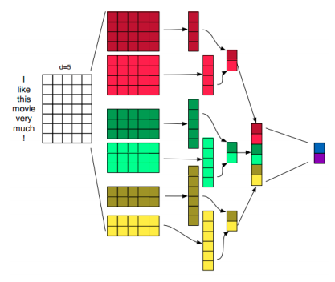
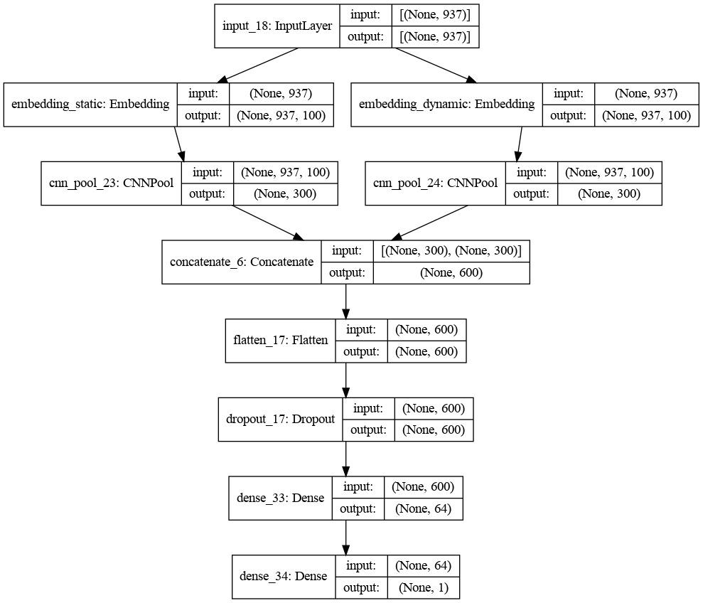
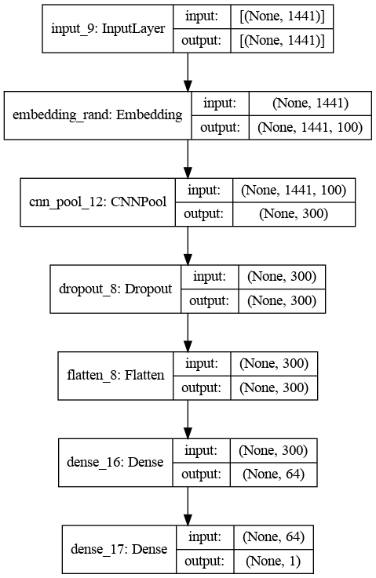

# Sentence-Classification-using-1D-ConvNets
Implementation of 1D Convolutional Neural Network for Sentence Classification based on the paper by [Yoon Kim(2014)]

[Yoon Kim(2014)]: <https://www.aclweb.org/anthology/D14-1181.pdf>

## Datasets
- Large Movie Review Dataset (https://ai.stanford.edu/~amaas/data/sentiment/)
- TREC (http://cogcomp.cs.illinois.edu/Data/QA/QC/)

## KimNet
- 100-dimensional GloVe vectors are used as embeddings.
- 2 Embedding layers are used, one with static weights and the other with dynamic weights which can be fine-tuned.
- Kernel size for Convolutions - {3, 4, 5} with 100 filters each.
- Each Embedding layer is connected to a different CNN block.
- All outputs from the CNN blocks are concatenated and given to the fully connected layer.
- Dropout rate set to 0.5
- Batch size set to 50 and model trained for 6 epochs.

## KimNet Architechure 

## ShallowNet Architecture
